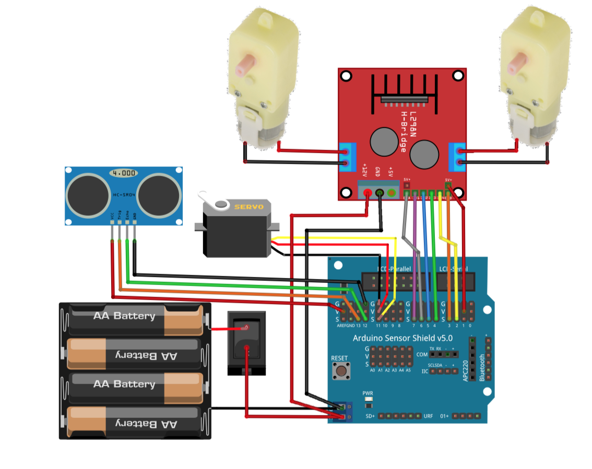
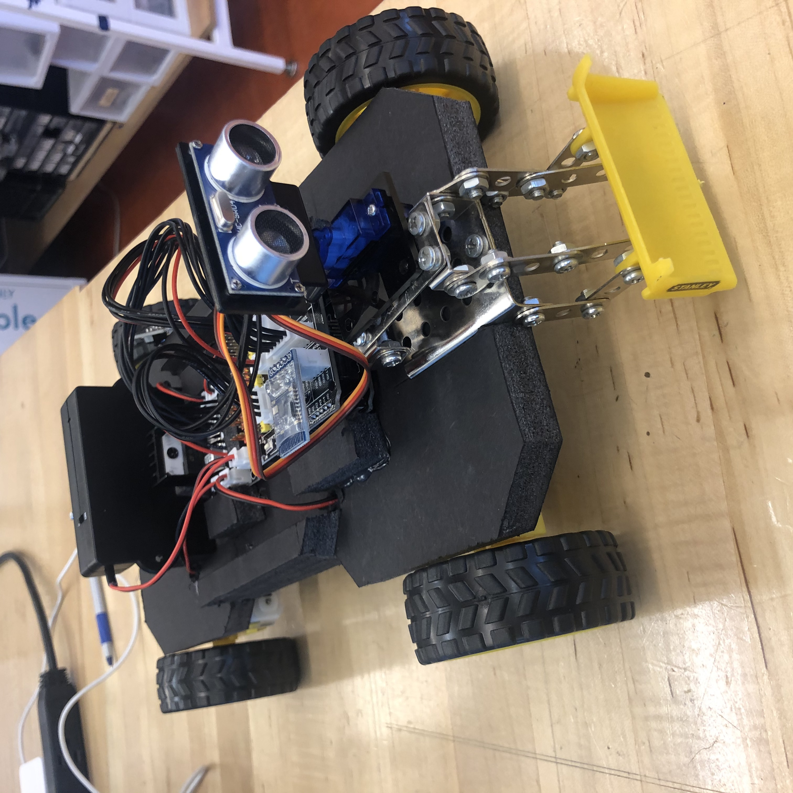
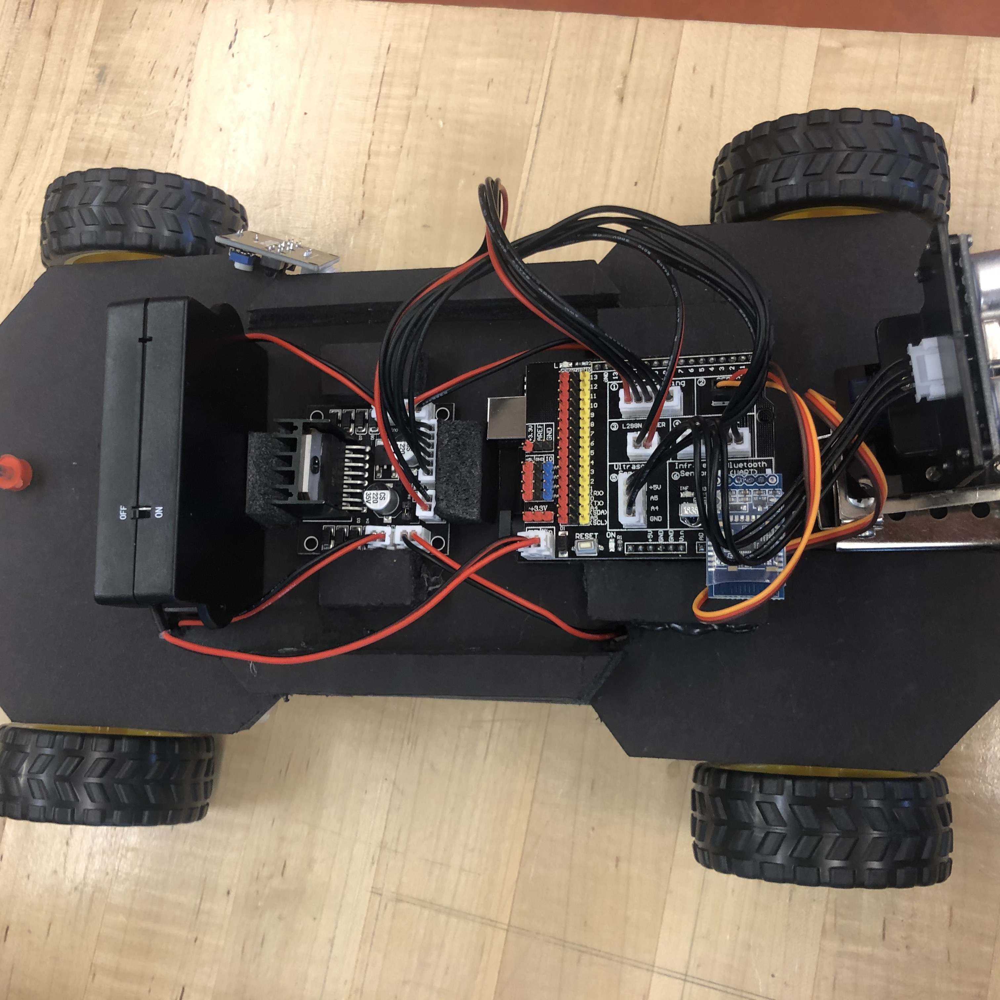

# Riojiang_CCA_mechatronics_2020
# 
# Week5-6-Avoid obstacle vehicle

## motor test

## ❓what i want to do 
I want to make a car that can avoid obstacles automatically. It looked like a sweeping robot, and in two weeks I had finished the assembly of the car and the coding of the motor part. In the ancient city of automobile assembly, I choose foam board as its chassis. Other parts I removed from other car models. Now it's a car that can move back and forth and left and right.

## ❓what i use
Arduino board 
Arduino sheild 
L298N motor drive 
DCMotor x 4
Ultrsonic sensor
Power switch 
Battery holder
Led light 

## Circuit 
Connect the Ultrasonic Sensor, Servo, and L298N to the Arduino Sensor Shield

##  result of exhibition

# 
# 
# 
# 
# 
# 

# Week4-Arduino traffic light

## ❓what i want to do 
🚥🚥🚥
Through the learning of Arduino, I want to make a traffic light controlled by code. The traffic light can simulate the process of waiting and flashing.

result of exhibition
👇🏼👇🏼👇🏼

# 
# 
# 
# 
# 
# 
# 

# Week3-Drawing machine

## ❓what i want to do 
For this drawing machine, I want to use the motor to drive the huge brush to draw. And I made this brush with lines of various colors to enrich the colors of the brush. So we can choose to any pigment you want to paint.

In the final work, I chose to use the traditional Chinese strip paper to allow the drawing machine to continuously draw images. When the drawing machine finished the work, I added my own words to form a work of human and machine. So I think that is kind of Human Computer Interaction

👇🏼👇🏼👇🏼

👇🏼👇🏼👇🏼

👇🏼👇🏼👇🏼

# 
# 
# 
# 
# 
# 
# 

# Week2-The Anxiety-buffer machine
In our daily life, we always have a lot of stress, and when we want to relax, this machine can quickly help people turn stress into motivation

## Anxiety-buffer machine

motion principle
👇🏼👇🏼👇🏼

result of exhibition
👇🏼👇🏼👇🏼

preview
👇🏼👇🏼👇🏼

preview
👇🏼👇🏼👇🏼

