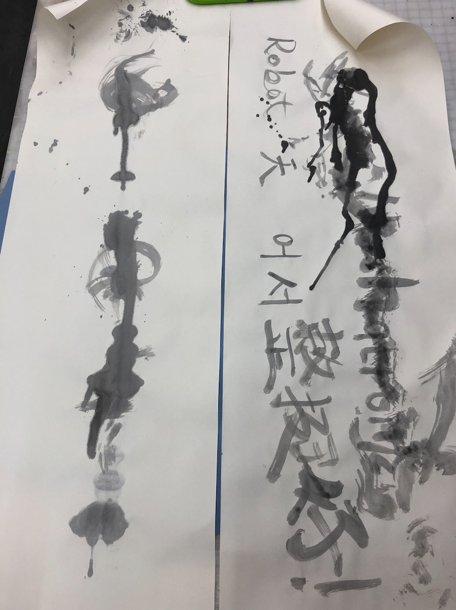
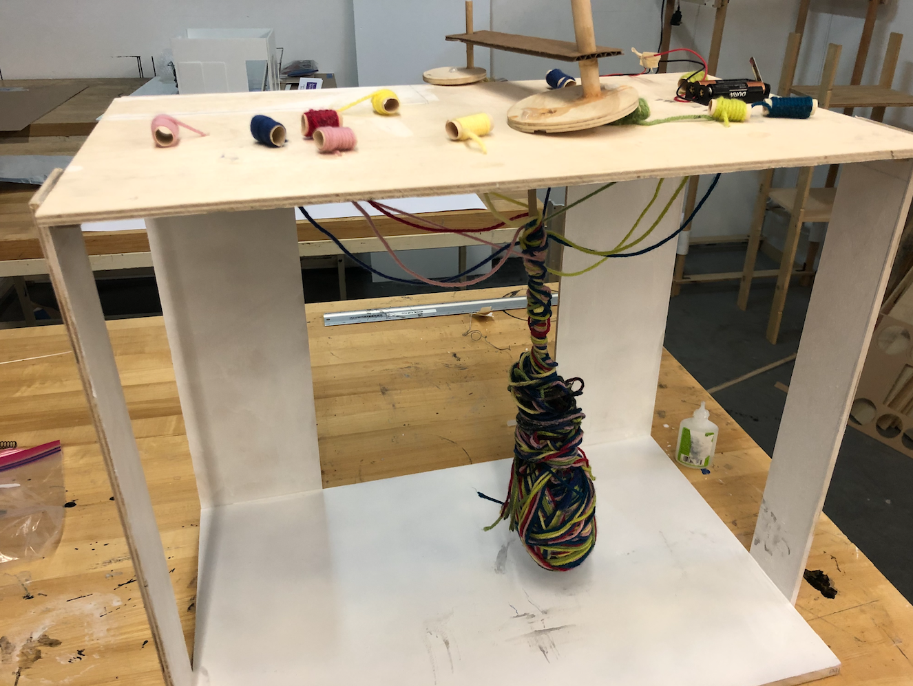
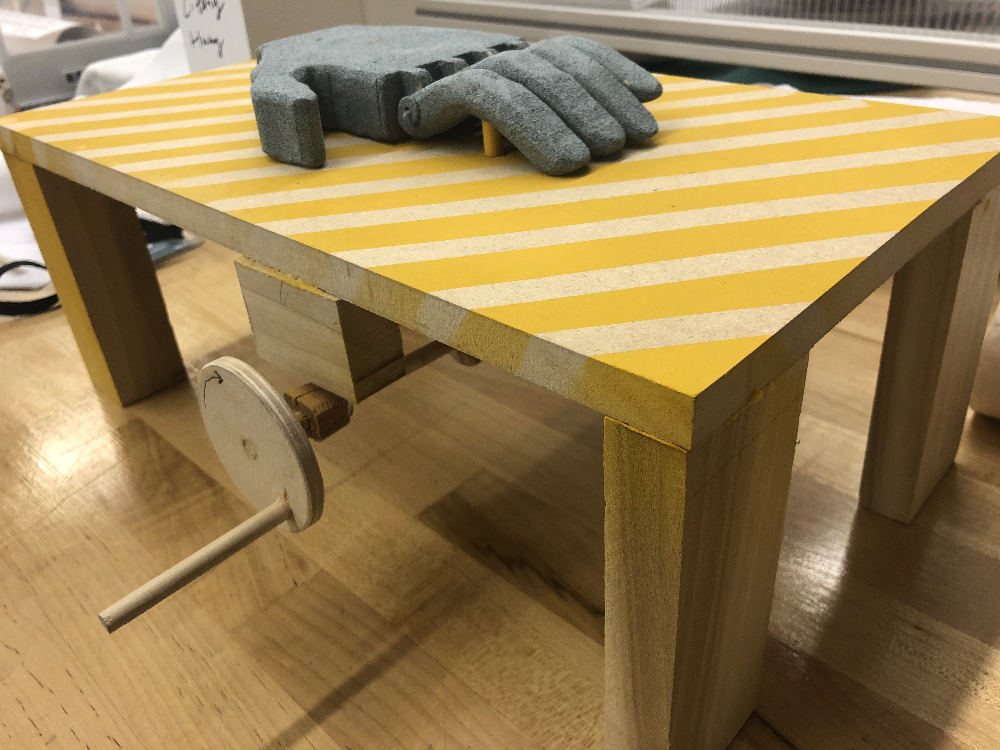
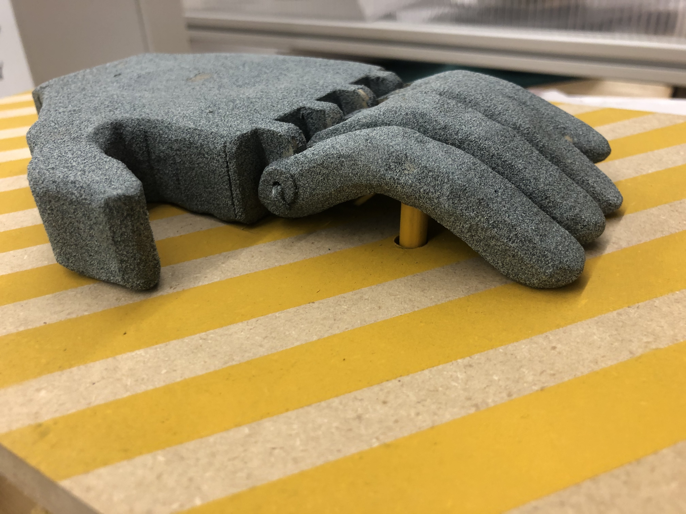

# Riojiang_CCA_mechatronics_2020
#
 
 
 
 
 
 
 
#
# Week4-Drawing machine

#
 
 
 
 
 
 
 
#
# Week3-Drawing machine

## ❓what i want to do 
For this drawing machine, I want to use the motor to drive the huge brush to draw. And I made this brush with lines of various colors to enrich the colors of the brush. So we can choose to any pigment you want to paint.

In the final work, I chose to use the traditional Chinese strip paper to allow the drawing machine to continuously draw images. When the drawing machine finished the work, I added my own words to form a work of human and machine. So I think that is kind of Human Computer Interaction
#
 
 
 
 
 
 
 
 
#
# Week2-The Anxiety-buffer machine
In our daily life, we always have a lot of stress, and when we want to relax, this machine can quickly help people turn stress into motivation

## Anxiety-buffer machine

result of exhibition
👇🏼👇🏼👇🏼

motion principle
👇🏼👇🏼👇🏼

preview
👇🏼👇🏼👇🏼

preview
👇🏼👇🏼👇🏼

